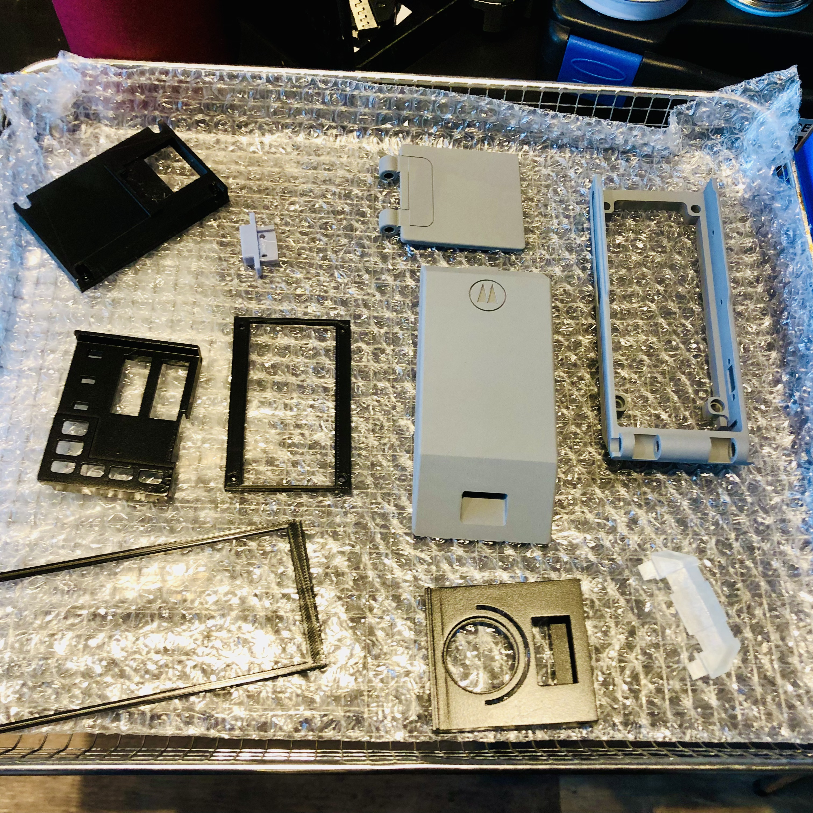
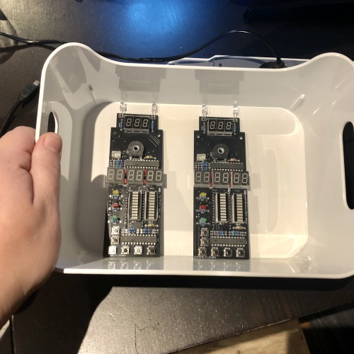
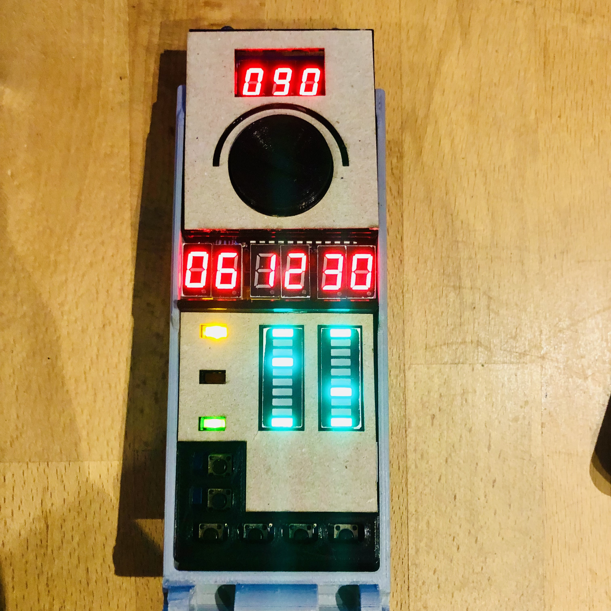
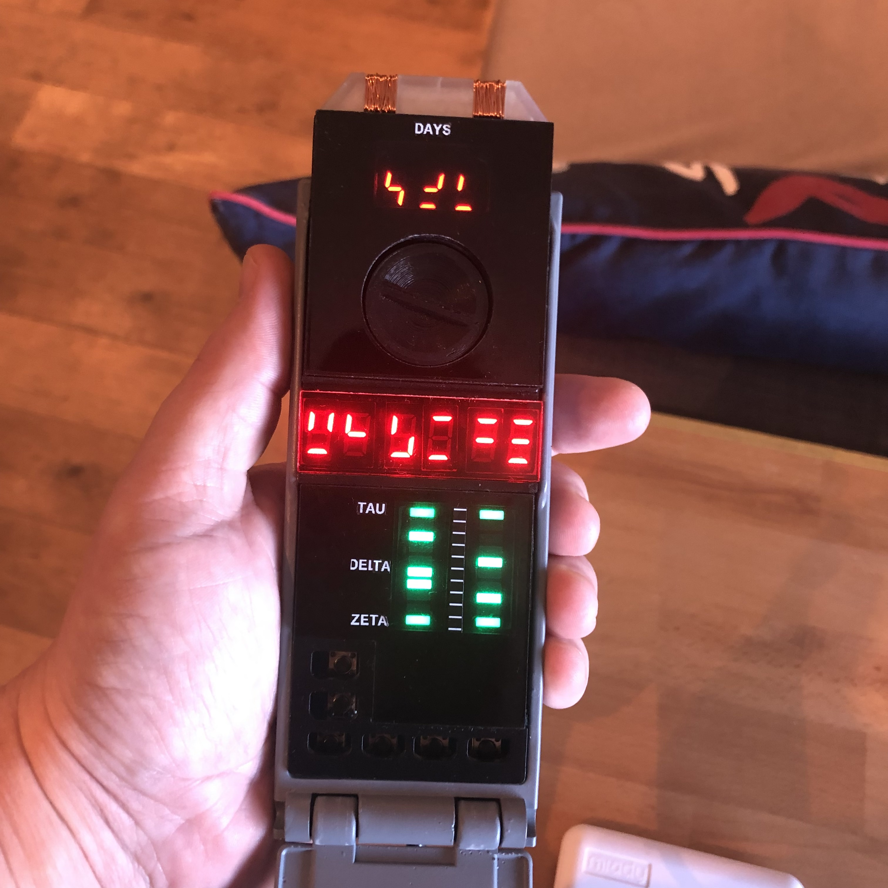

## Table of Contents
1. [Introduction](#introduction)
2. [Schematics](#schematics)
3. [PCB](#pcb)
4. [Hardware](#hardware)
5. [Sources](#sources)
6. [Remaining tasks](#remaining-tasks]

## Introduction
### About the story...
Sliders is a 1995 sci-fi television series :tv: that follows Quinn Mallory, a young genius who invents a device called the "Timer" that allows him and a small group of friends—Wade, Rembrandt, and Professor Arturo—to travel between parallel universes. Each universe presents a different version of Earth with unique cultures, histories, and technologies. The group "slides" from one world to the next, searching for their way back home while facing various challenges along the way.

The "Timer" is a handheld device that controls the sliding process, dictating how long the group must stay in each universe before they can slide again. It opens a wormhole :cyclone: at set intervals, and if the group misses their window, they are stranded in the current universe. The Timer becomes central to the story, especially when it malfunctions or is damaged, leading to unpredictable slides or dangerous situations.

### This is Open Source ! What does this mean for you?
<b>Source Code:</b> You can download and modify the entire source code to suit your requirements. Whether you want to fix a bug, add new features, or create your own version, the choice is yours!

<b>3D Models:</b> All 3D models I use are accessible and can be adjusted. If you want to tweak the designs or use them for your own projects, you are free to do so.

<b>Vector Files:</b> Any vector graphic files I provide can also be edited. This includes things like logos, UI components, and other design assets that you can adapt for personal use.

### Why Open Source?
By being open source, I encourage collaboration, innovation, and transparency. You have the ability to contribute back to the project, improving it for everyone in the community. I believe this leads to better, faster development and a more inclusive project environment.

> [!IMPORTANT]
> Feel free to fork this project for your own needs, or contribute directly by making a pull request :blush: :heart:

## Schematics

## PCB
> [!TIP]
> By adhering to the PCB size and component placements, you will be able to upgrade or integrate your own PCB without making any changes to the 3D models.
> 
Size : 137mm x 50mm
## Hardware
### Bill of materials
| Component                                             | Link |
|-------------------------------------------------------|-------------|
| 7 segment red LED digit - 0.36 inch cathode (HH:MM:SS) | https://fr.aliexpress.com/item/1005002680227414.html |
| 7 segment red LED digit - 0.3 inch cathode (DDD)       | https://fr.aliexpress.com/item/32726538415.html |
| 10 green LEDs bargraph                                 | https://fr.aliexpress.com/item/1005006697608767.html      |
| Yellow, red, green LEDs (TAU, DELTA, ZETA)             | https://fr.aliexpress.com/item/1005005678632501.html |
| Red LEDs (between HH:MM:SS)                            | https://fr.aliexpress.com/item/1005005678632501.html |
| Light LEDs (top laser) | https://fr.aliexpress.com/item/32468733055.html |
| Buzzer | https://fr.aliexpress.com/item/1005006209077202.html |
| Potentiometer 10k                                      | https://fr.aliexpress.com/item/1005005671238738.html |
| Red acrylic sheets                                     | [https://fr.aliexpress.com/item/4000283087852.html](https://fr.aliexpress.com/item/4000283087852.html) |
| Translucent acrylic sheets                                     | [https://fr.aliexpress.com/item/4000283087852.html](https://fr.aliexpress.com/item/1005004925861639.html) |
| Arduino Nano V3 | [https://www.amazon.fr/dp/B0722YYBSS](https://www.amazon.fr/dp/B0722YYBSS) |

### Component Dimensions
> [!TIP]
> These are the dimensions used for the project. You should be able to use any component that adheres to these dimensions without needing to adapt anything on the PCB.

| Component                                             | Length (mm) | Width (mm) | Height (mm) |
|-------------------------------------------------------|-------------|------------|-------------|
| 7 segment red LED digit - 0.36 inch cathode (HH:MM:SS) | 14.00       | 7.40       | 7.20        |
| 7 segment red LED digit - 0.3 inch cathode (DDD)       | 12.70       | 7.60       | 7.00        |
| 10 green LEDs bargraph                                 | 25.40       | 10.10      | 7.90        |
| Yellow, red, green LEDs (TAU, DELTA, ZETA)             | 5.00        | 2.00       | 7.00        |
| Red LEDs (between HH:MM:SS)                            | 3.00        | 2.00       | 4.00        |
| Potentiometer 10k                                      | -           | -          | -           |

## 3D models
### Main body
### Battery box
### Buttons plate
### Top plate

## Sources
+ [https://www.therpf.com/forums/threads/how-to-build-sliders-timer-electronics.104308/](https://www.therpf.com/forums/threads/how-to-build-sliders-timer-electronics.104308/)

## Remaining tasks
[ ] Make a big party :tada:

## Pictures :camera:

